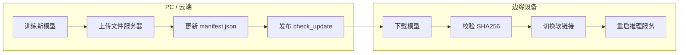

# OTA 模型更新

## 更新流程



## manifest.json

放到 HTTP 服务器根目录（由 `config.yaml` 中 `ota.server_url` 指定）：

```json
{
  "version": "3.0",
  "files": [
    {
      "name": "model.ncnn.bin",
      "url": "http://172.20.10.6:8080/models/model.ncnn.bin",
      "sha256": "639d71e4754f4e0aa19bf0b5b6431068b950ab09529f11f439971fb7dd62bfc8"
    },
    {
      "name": "model.ncnn.bin",
      "url": "https://amplifier-badge-awoke.ngrok-free.dev/models/model.ncnn.bin",
      "sha256": "639d71e4754f4e0aa19bf0b5b6431068b950ab09529f11f439971fb7dd62bfc8"
    }
  ]
}
```

## 配置项

| 配置项 | 说明 | 默认值 |
|--------|------|--------|
| `ota.server_url` | HTTP 文件服务器地址 | — |
| `ota.version_path` | 版本清单文件名 | `version.json` |
| `ota.check_interval` | 定时检查间隔（秒） | `300` |
| `ota.model_dir` | 版本化模型存储目录 | — |
| `ota.current_symlink` | 当前版本软链接路径 | — |
| `ota.backup_count` | 保留旧版本数 | `3` |
| `ota.inference_restart_cmd` | 更新后重启命令 | `""` |

## 搭建 OTA 服务器

```bash
python3 -m http.server 8080
ngrok http 8080
# ngrok URL -> config.yaml ota.server_url
```
