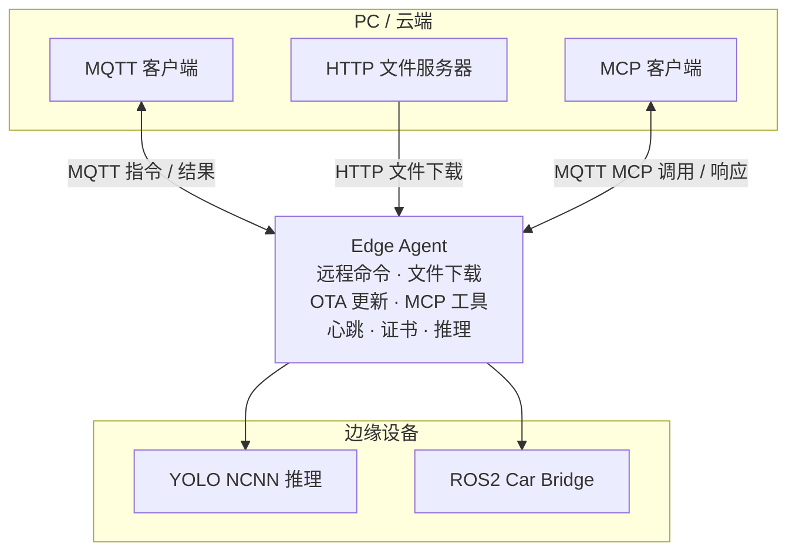
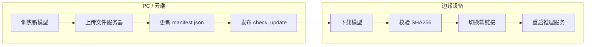
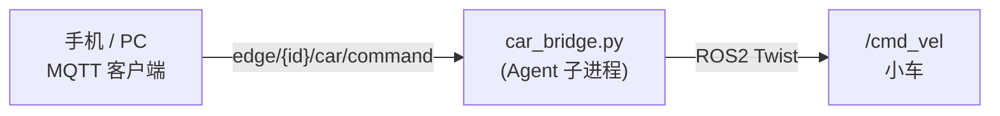
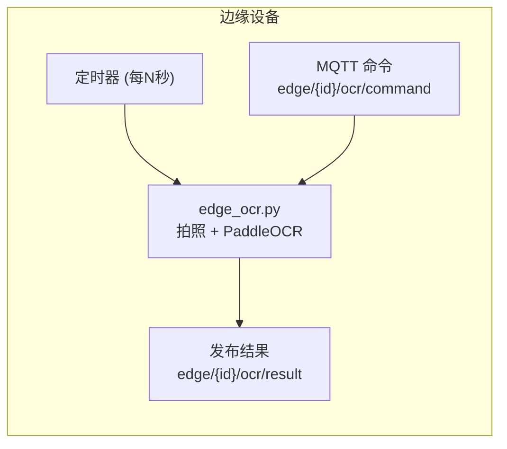

# Edge Agent

通用边缘设备管理 Agent，通过 MQTT 实现远程控制、文件下发、OTA 模型更新、ROS2 小车控制。支持任意 Linux 设备：树莓派、Jetson、x86 工控机、ARM 开发板等。

## 架构



## 功能

| 功能 | 说明 | MQTT 主题 |
|------|------|-----------|
| **远程命令** | 在设备上执行任意 shell 命令，获取输出 | `edge/{id}/command` |
| **文件下载** | 从 URL 下载文件到设备指定目录 | `edge/{id}/download` |
| **OTA 更新** | 定时检查版本清单，自动下载、校验、切换模型 | `edge/{id}/mcp/call` |
| **模型回滚** | 一键回滚到上一个模型版本 | `edge/{id}/mcp/call` |
| **设备心跳** | 每 30s 上报设备状态（CPU、内存、运行时间） | `edge/{id}/heartbeat` |
| **ROS2 桥接** | MQTT → ROS2 `/cmd_vel` 小车控制 | `edge/{id}/car/command` |
| **MCP 工具** | 通过 MCP 协议暴露 8+ 个设备管理工具 | `edge/{id}/mcp/register` |
| **证书管理** | 支持自动证书签发（mTLS） | — |
| **推理调用** | 调用 YOLO 推理服务进行目标检测 | — |
| **OCR 识别** | 定时或 MQTT 触发摄像头拍照，PaddleOCR 文字识别 | `edge/{id}/ocr/command` / `edge/{id}/ocr/result` |

## 支持平台

一键安装脚本自动识别架构，支持以下平台：

| 架构 | 设备示例 | 二进制后缀 |
|------|---------|-----------|
| `linux/amd64` | 普通 PC、服务器、工控机 | `agent-amd64` |
| `linux/arm64` | 树莓派 3B+/4B/5、Jetson Nano/Orin | `agent-aarch64` |
| `linux/armv7l` | 树莓派 Zero/2W/3B、香橙派 | `agent-armv7l` |

## 快速开始

### 一键安装（推荐）

```bash
# 仅安装 agent（自动适配架构）
curl -fsSL https://raw.githubusercontent.com/MINGTIANJIAN886/edge_agent/main/agent.sh | sudo bash

# 安装 agent + ROS2 Car Bridge
curl -fsSL https://raw.githubusercontent.com/MINGTIANJIAN886/edge_agent/main/agent.sh | sudo bash -s -- --bridge

# 自定义设备 ID
curl -fsSL https://raw.githubusercontent.com/MINGTIANJIAN886/edge_agent/main/agent.sh | sudo bash -s -- my-device

# 自定义 ID + ROS2 桥
curl -fsSL https://raw.githubusercontent.com/MINGTIANJIAN886/edge_agent/main/agent.sh | sudo bash -s -- my-device --bridge
```

脚本自动完成：检测架构 → 下载对应二进制 → 生成配置文件 → 安装 systemd 服务 → 启动 agent。

### 手动编译

```bash
git clone https://github.com/MINGTIANJIAN886/edge_agent.git
cd edge_agent

# 安装依赖
make deps

# 编译当前平台
make build

# 编译树莓派 (arm64)
make build-aarch64

# 编译 ARMv7 (树莓派 Zero/3B)
make build-armv7l

# 编译全部平台
make build-all
```

编译产物在 `build/` 目录下。

### 使用 Docker

```bash
docker run -d --name edge-agent \
  -v /etc/agent:/etc/agent \
  --network host \
  ghcr.io/MINGTIANJIAN886/edge-agent:latest
```

## 配置

配置文件路径：`/etc/agent/config.yaml`（可通过 `-config` 参数修改）。

完整配置示例：

```yaml
device_id: "pi-001"
download_dir: "/tmp/agent/downloads"
heartbeat_interval: 30
log_dir: "/var/log/agent"

mqtt:
  broker: "your-broker.cloud"
  port: 8883
  client_id: "agent-pi-001"
  username: "your-username"
  password: "your-password"
  topic:
    command: "edge/pi-001/command"
    download: "edge/pi-001/download"
    heartbeat: "edge/pi-001/heartbeat"
    result: "edge/pi-001/result"
    register: "edge/pi-001/register"
    mcp_register: "edge/pi-001/mcp/register"
    mcp_call: "edge/pi-001/mcp/call"

ota:
  server_url: "https://your-ota-server.com"
  version_path: "version.json"
  check_interval: 300
  model_file: "/home/pi/models/model.ncnn.bin"
  model_dir: "/home/pi/models"
  current_symlink: "/home/pi/models/current"
  backup_count: 3
  inference_restart_cmd: "systemctl restart yolov8"

inference:
  service_url: "http://localhost:8080"
  timeout: 30

auth:
  method: "password"
  token: ""

cert:
  cert_file: "/etc/agent/certs/client.crt"
  key_file: "/etc/agent/certs/client.key"
  ca_file: "/etc/ssl/certs/ca-certificates.crt"
```

### 环境变量（一键安装时覆盖）

| 变量 | 默认值 | 说明 |
|------|--------|------|
| `DEVICE_ID` | `pi-001` | 设备唯一 ID |
| `MQTT_BROKER` | `ca15b49bc8b442638f0cade1e45585ce.s1.eu.hivemq.cloud` | MQTT 服务器地址 |
| `MQTT_PORT` | `8883` | MQTT 端口（8883=SSL, 1883=TCP） |
| `MQTT_USER` | `liyankun` | MQTT 用户名 |
| `MQTT_PASS` | `liyankun152455A` | MQTT 密码 |
| `OTA_SERVER` | `https://amplifier-badge-awoke.ngrok-free.dev` | OTA 更新服务器 |

```bash
# 自定义 MQTT 和 OTA 服务器
DEVICE_ID="car-01" MQTT_BROKER="my-broker.com" OTA_SERVER="https://my-ota.com" \
  curl -fsSL https://raw.githubusercontent.com/MINGTIANJIAN886/edge_agent/main/agent.sh | sudo bash
```

## MQTT 命令

> 以下命令将 `pi-001` 替换为你的设备 ID。

### 下载文件

```bash
mosquitto_pub -h "ca15b49bc8b442638f0cade1e45585ce.s1.eu.hivemq.cloud" \
  -p 8883 --cafile /etc/ssl/certs/ca-certificates.crt \
  -u "liyankun" -P "liyankun152455A" \
  -t "edge/pi-001/download" \
  -m '{
    "url":"https://example.com/file.bin",
    "dest_dir":"/home/pi/downloads",
    "dest_name":"file.bin"
  }'
```

结果返回到 `edge/pi-001/download/result`。

### 执行命令

```bash
mosquitto_pub -h "ca15b49bc8b442638f0cade1e45585ce.s1.eu.hivemq.cloud" \
  -p 8883 --cafile /etc/ssl/certs/ca-certificates.crt \
  -u "liyankun" -P "liyankun152455A" \
  -t "edge/pi-001/command" \
  -m '{"id":"cmd1","command":"uptime && free -h","timeout":10}'
```

结果返回到 `edge/pi-001/command/result`。

### 设备信息

```bash
# 通过 MCP 调用查询
mosquitto_pub -h "ca15b49bc8b442638f0cade1e45585ce.s1.eu.hivemq.cloud" \
  -p 8883 --cafile /etc/ssl/certs/ca-certificates.crt \
  -u "liyankun" -P "liyankun152455A" \
  -t "edge/pi-001/mcp/call" \
  -m '{"id":"info","method":"device_info","params":{}}'
```

### OTA 更新

```bash
# 触发更新检查（agent 会拉取 version.json 比较版本）
mosquitto_pub -h "ca15b49bc8b442638f0cade1e45585ce.s1.eu.hivemq.cloud" \
  -p 8883 --cafile /etc/ssl/certs/ca-certificates.crt \
  -u "liyankun" -P "liyankun152455A" \
  -t "edge/pi-001/mcp/call" \
  -m '{"id":"ota","method":"check_update","params":{}}'

# 回滚到上一版本
mosquitto_pub -h "ca15b49bc8b442638f0cade1e45585ce.s1.eu.hivemq.cloud" \
  -p 8883 --cafile /etc/ssl/certs/ca-certificates.crt \
  -u "liyankun" -P "liyankun152455A" \
  -t "edge/pi-001/mcp/call" \
  -m '{"id":"roll","method":"rollback_model","params":{}}'

# 重启服务
mosquitto_pub -h "ca15b49bc8b442638f0cade1e45585ce.s1.eu.hivemq.cloud" \
  -p 8883 --cafile /etc/ssl/certs/ca-certificates.crt \
  -u "liyankun" -P "liyankun152455A" \
  -t "edge/pi-001/mcp/call" \
  -m '{"id":"svc","method":"restart_service","params":{"service_name":"yolov8"}}'

# 获取日志
mosquitto_pub -h "ca15b49bc8b442638f0cade1e45585ce.s1.eu.hivemq.cloud" \
  -p 8883 --cafile /etc/ssl/certs/ca-certificates.crt \
  -u "liyankun" -P "liyankun152455A" \
  -t "edge/pi-001/mcp/call" \
  -m '{"id":"log","method":"get_logs","params":{"unit":"agent","lines":50}}'
```

### 查看所有消息

```bash
mosquitto_sub -h "ca15b49bc8b442638f0cade1e45585ce.s1.eu.hivemq.cloud" \
  -p 8883 --cafile /etc/ssl/certs/ca-certificates.crt \
  -u "liyankun" -P "liyankun152455A" \
  -t "#" -v
```

## OTA 更新

### 更新流程



### manifest.json 格式

放到 HTTP 服务器根目录（由 OTA 配置中的 `server_url` 指定）：

```json
{
  "version": "3.0",
  "files": [
    {
      "name": "model.ncnn.bin",
      "url": "http://172.20.10.6:8080/models/model.ncnn.bin",
      "sha256": "639d71e4754f4e0aa19bf0b5b6431068b950ab09529f11f439971fb7dd62bfc8"
    },
    {
      "name": "model.ncnn.bin",
      "url": "https://amplifier-badge-awoke.ngrok-free.dev/models/model.ncnn.bin",
      "sha256": "639d71e4754f4e0aa19bf0b5b6431068b950ab09529f11f439971fb7dd62bfc8"
    }
  ]
}
```

### OTA 配置说明

| 配置项 | 说明 | 默认值 |
|--------|------|--------|
| `server_url` | HTTP 文件服务器地址（可用 ngrok 暴露本地端口） | — |
| `version_path` | 版本清单文件名 | `version.json` |
| `check_interval` | 定时检查间隔（秒） | `300`（5 分钟） |
| `model_dir` | 版本化模型存储目录 | — |
| `current_symlink` | 当前版本软链接路径 | — |
| `backup_count` | 保留的旧版本数 | `3` |
| `inference_restart_cmd` | 更新后重启推理服务的命令 | `""` |

### 快速搭建 OTA 服务器

```bash
# 使用 Python 快速启动 HTTP 文件服务器
python3 -m http.server 8080

# 或使用 ngrok 暴露本地服务
ngrok http 8080
# 将 ngrok URL 填入 config.yaml 的 ota.server_url

# 外部设备通过 ngrok URL 即可访问文件
```

## ROS2 Car Bridge

将 MQTT 命令转为 ROS2 Twist 消息发布到 `/cmd_vel`，实现远程小车控制。Agent 自动检测 `/opt/ros/` 下安装的 ROS2 版本（humble / jazzy / rolling 等），无需手动指定。

### 架构



### 部署

Agent 启动时会自动检测 ROS2 版本并启动桥接：

```bash
# 一键安装时带上 --bridge
curl -fsSL https://raw.githubusercontent.com/MINGTIANJIAN886/edge_agent/main/agent.sh | sudo bash -s -- --bridge

# 或手动安装依赖
pip install paho-mqtt

# agent 会自动启动桥接，无需手动操作
```

### 控制命令

```bash
# 方向控制
mosquitto_pub -h "ca15b49bc8b442638f0cade1e45585ce.s1.eu.hivemq.cloud" \
  -p 8883 --cafile /etc/ssl/certs/ca-certificates.crt \
  -u "liyankun" -P "liyankun152455A" \
  -t "edge/pi-001/car/command" \
  -m '{"direction":"forward","speed":0.2}'

# 原地旋转
mosquitto_pub ... -m '{"direction":"rotate_l","speed":0.3}'
mosquitto_pub ... -m '{"direction":"rotate_r","speed":0.3}'

# 弧线运动（前进+转向的组合）
mosquitto_pub ... -m '{"direction":"curve","linear":0.2,"angular":0.1}'

# 直接控制线速度和角速度（-1.0 ~ 1.0）
mosquitto_pub ... -m '{"linear_x":0.5,"angular_z":0.3}'

# 带自动停止（运动持续毫秒后自动 stop）
mosquitto_pub ... -m '{"direction":"forward","speed":0.3,"duration_ms":2000}'
```

支持的指令与参数：

| 参数 | 类型 | 说明 | 默认值 |
|------|------|------|--------|
| `direction` | string | `forward` / `backward` / `left` / `right` / `stop` / `rotate_l` / `rotate_r` / `curve` | `stop` |
| `speed` | float | 速度倍率 0.0 ~ 1.0 | `0.2` |
| `linear_x` | float | 直接指定线速度（-1.0 ~ 1.0），替代 direction | — |
| `angular_z` | float | 直接指定角速度（-1.0 ~ 1.0），替代 direction | — |
| `linear` | float | curve 模式下的线速度 | `speed` |
| `angular` | float | curve 模式下的角速度 | `speed * 0.5` |
| `duration_ms` | int | 运动持续毫秒数，到期自动停止 | `0`（持续运动） |

结果返回到 `edge/pi-001/car/result`。

## OCR 文字识别

Agent 支持通过 PaddleOCR 在边缘设备上进行文字识别，内置定时自动触发和 MQTT 远程触发两种模式。

### 架构



### 部署

```bash
# 1. 在设备上安装 Python 依赖
pip install paddlepaddle paddleocr opencv-python

# 2. 上传 OCR 推理脚本
scp edge_ocr.py pi@192.168.x.x:/opt/agent/

# 3. 配置 config.yaml 启用 OCR
#    ocr:
#      enabled: true
#      script_path: "/opt/agent/edge_ocr.py"
#      interval: 30            # 自动触发间隔（秒），0=关闭定时
#      conf_threshold: 0.5
#      command_topic: "edge/pi-001/ocr/command"
#      result_topic: "edge/pi-001/ocr/result"

# 4. 重新编译部署 Agent
make build-aarch64
scp build/agent-aarch64 pi@192.168.x.x:/usr/local/bin/agent
ssh pi@192.168.x.x "sudo systemctl restart agent"
```

### 使用方式

**定时触发**：配置 `interval` 后，Agent 自动按间隔拍照识别并上报结果。

**手动触发**：向 MQTT 命令主题发送任意消息：

```bash
mosquitto_pub -h "ca15b49bc8b442638f0cade1e45585ce.s1.eu.hivemq.cloud" \
  -p 8883 --cafile /etc/ssl/certs/ca-certificates.crt \
  -u "liyankun" -P "liyankun152455A" \
  -t "edge/pi-001/ocr/command" \
  -m '{}'
```

**结果上报**：（订阅 `edge/{id}/ocr/result`）：

```json
{
  "device_id": "pi-001",
  "success": true,
  "trigger": "timer",
  "texts": [
    {"text": "前方施工", "confidence": 0.97, "bbox": [[10,20],[100,20],[100,50],[10,50]]},
    {"text": "限速30", "confidence": 0.92, "bbox": [[200,80],[300,80],[300,110],[200,110]]}
  ],
  "timestamp": 1712345678.123
}
```

- `trigger`: `"timer"` 自动触发 / `"command"` MQTT 远程触发
- `texts[].bbox`: 四个角点坐标 `[左上, 右上, 右下, 左下]`

## 系统管理

### 查看状态

```bash
# agent 状态
sudo systemctl status agent

# 实时日志
journalctl -u agent -f

# 查看桥接状态（如果安装了 --bridge）
sudo systemctl status car_bridge
```

### MCP 工具列表

agent 启动时自动向 MQTT 注册以下 MCP 工具：

| 工具 | 说明 |
|------|------|
| `device_info` | 获取设备系统信息（CPU、内存、磁盘、运行时间） |
| `execute_command` | 执行 shell 命令 |
| `download_file` | 下载文件到设备 |
| `restart_service` | 重启 systemd 服务 |
| `get_logs` | 获取 journald 日志 |
| `detect_objects` | 调用 YOLO 推理进行目标检测 |
| `check_update` | 检查 OTA 模型更新 |
| `rollback_model` | 回滚模型版本 |
| `run_ocr` | 触发一次 OCR 文字识别，返回识别结果 |

### 证书管理

支持三种认证方式：

```yaml
auth:
  # "password" - 用户名密码
  # "token"    - Token 认证
  # "cert"     - mTLS 客户端证书
  method: "password"
```

自动证书签发：

```bash
# 在配置中启用 auto_enroll，或命令行触发
./agent -config /etc/agent/config.yaml -enroll
```

## 项目结构

```
├── cmd/agent/main.go              # Agent 入口
├── internal/
│   ├── bridge/bridge.go           # ROS2 版本检测 & 桥接管理
│   ├── config/config.go           # YAML 配置解析
│   ├── download/download.go       # 文件下载模块
│   ├── enroll/enroll.go           # 证书自动签发
│   ├── heartbeat/heartbeat.go     # 心跳上报
│   ├── mcp/mcp.go                 # MCP 工具注册 & 调度
│   ├── ota/ota.go                 # OTA 更新 & 回滚
│   └── remote/remote.go           # 远程命令执行
├── build/                         # 预编译二进制
│   ├── agent-amd64
│   ├── agent-aarch64
│   └── agent-armv7l
├── models/                        # YOLO NCNN 模型
├── car_bridge.py                  # ROS2 MQTT 桥接脚本
├── edge_ocr.py                    # PaddleOCR 推理脚本（部署在 /opt/agent/）
├── requirements-ocr.txt           # OCR Python 依赖
├── agent.sh                       # 一键安装脚本
├── Makefile                       # 编译 & 发布
├── go.mod / go.sum                # Go 依赖
└── README.md                      # 本文件
```

## 开发

```bash
# 克隆仓库
git clone https://github.com/MINGTIANJIAN886/edge_agent.git
cd edge_agent

# 安装 Go 依赖
make deps

# 编译
make build

# 运行（开发模式）
./build/agent-amd64 -config /etc/agent/config.yaml

# 发布
make release
# 输出在 build/ 目录，包含 SHA256SUM
```

## License

MIT
